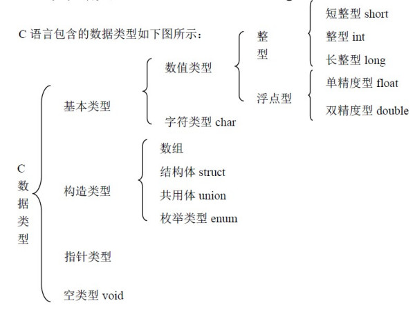
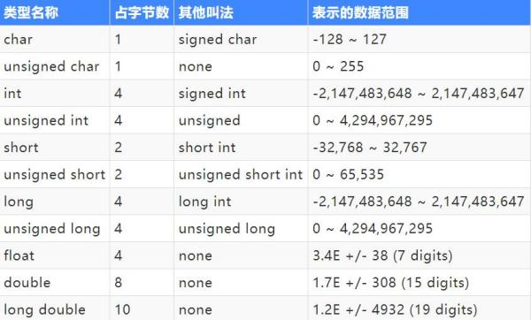

# 数据类型（基本数据类型）

基本类型：整形，浮点型

构造类型：数组 结构体 struct 公用体union 枚举类型enum

指针类型

空类型void

1.所占字节数

2.存储区别

3.不同类型数据转换（分为隐式，显式）

4.特殊性

    （1） bool
    （2） float 精度问题
    （3） char型是否有符号
    （4） 不同形式的0值
    （5） 

5.字符类型 ASCII

    字符类型有符号和无符号（标准C未定义是否有无符号）

# 变量和常量

常量：在程序执行过程中值不会发生变化的量；

    整形常量 1，790
    实型常量 3.14，5.26，1.999
    字符常量:由单引号包围的单个字符或转义字符 如： ‘\t’（转义字符） '\015'(代表三位八进制数) ‘\x7f’（两位16进制数）
    字符串常量：由双引号包围一个或多个字符组成的序列，比如："fdsdff"
    标识常量:#define

变量：用来保存一些特定内容，并且在程序执行过程中值随时会发生变化的量